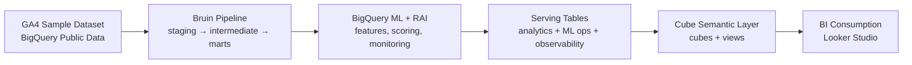
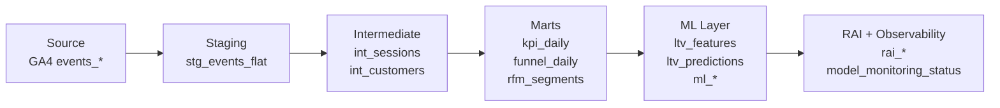
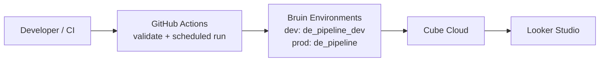

# DE-PROJECT — GA4 Ecommerce Analytics Pipeline

**Why:** Transform raw GA4 ecommerce events into trusted analytics, ML predictions, and BI-ready serving tables — with a semantic layer enforcing consistent metrics across all dashboards.

**What:** An end-to-end data pipeline that reads GA4 events from BigQuery, runs them through Bruin (ELT), trains a customer LTV model in BigQuery ML, evaluates it with Responsible AI monitoring, and exposes everything through a Cube semantic layer for Looker Studio dashboards.

---

## System Flow







---

## Quick Navigation

### Source of Truth

| Layer | Location |
|-------|----------|
| Real truth | `assets/` — Bruin SQL assets |
| Feature contracts | `docs/features/*.yaml` |
| Feature history | `docs/features/<feature_id>/history.md` |
| Cross-cutting docs | `docs/*.md` |
| Implementation plans | `plans/` |
| This overview | `README.md` |

### Active Features

| Feature | Status | Description |
|---------|--------|-------------|
| [data-pipeline](docs/features/data-pipeline.yaml) | active | GA4 → BigQuery ELT pipeline |
| [analytics-serving-layer](docs/features/analytics-serving-layer.yaml) | active | BigQuery serving tables |
| [cube-semantic-layer](docs/features/cube-semantic-layer.yaml) | active | Cube semantic model |
| [lineage-and-observability](docs/features/lineage-and-observability.yaml) | active | Lineage docs + monitoring tables |
| [deployment-cicd](docs/features/deployment-cicd.yaml) | building | GitHub Actions CI/CD + scheduled runs; GitHub secret is managed outside the repo |

### Key Docs

- [High-level Pipeline](docs/DE%20PROJECT%20-%20High-level%20Pipeline.md) — full architecture overview
- [Lineage](docs/lineage.md) — 4 Mermaid diagrams: data, ML, semantic, observability
- [Dataset](docs/bigquery-public-data.ga4_obfuscated_sample_ecommerce%20Dataset.md) — source data notes

### Getting Started

```bash
# Install Bruin (Windows)
run_bruin.bat --version

# Validate all assets
bruin validate .

# Run full pipeline (requires GCP credentials)
bruin run --environment prod .
```

See `plans/deployment-layer-plan.md` for full local developer setup and CI/CD configuration.

---

## Tech Stack

```
GA4 (BigQuery Public) → Bruin (ELT) → BigQuery ML (LTV model)
                                       → BigQuery (serving tables)
                                       → Cube (semantic layer, Cube Cloud)
                                       → Looker Studio (BI dashboards)
```

**Storage + compute:** BigQuery
**Pipeline framework:** Bruin
**ML:** BigQuery ML (BOOSTED_TREE_REGRESSOR)
**Semantic layer:** Cube (open-source, deployed to Cube Cloud)
**BI:** Looker Studio (PostgreSQL via Cube Cloud SQL API)
**CI/CD:** GitHub Actions
