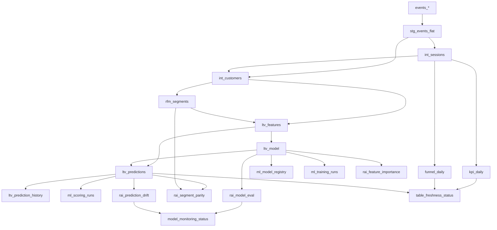

## DE Pipeline Implementation Plan

> **For agentic workers:** REQUIRED SUB-SKILL: Use superpowers:subagent-driven-development (recommended) or superpowers:executing-plans to implement this plan task-by-task. Steps use checkbox (`- [ ]`) syntax for tracking.

**Goal:** Build an end-to-end data engineering pipeline that transforms GA4 ecommerce events from BigQuery into trusted serving tables, BigQuery ML predictions, Responsible AI monitoring, and observability — all orchestrated by Bruin.

**Architecture:** Bruin orchestrates SQL assets against BigQuery. Each pipeline layer is a group of SQL assets with explicit dependencies and data quality checks. BigQuery ML handles training, scoring, and evaluation in-place. Observability and metadata are materialized as first-class tables.

**Tech Stack:** Bruin (pipeline framework), BigQuery (storage + compute), BigQuery ML (model training + scoring), SQL (all transforms)

**Source dataset:** `bigquery-public-data.ga4_obfuscated_sample_ecommerce.events_*` — three months of obfuscated GA4 event data (2020-11-01 to 2021-01-31).

### Phase 0 — Project Scaffold

#### Task 0.1: Initialize the Bruin project

**Files:**
- Create: `pipeline.yml`
- Create: `.bruin.yml`
- Create: `.gitignore`
- Create: `assets/` (directory)

- [ ] **Step 1: Install Bruin CLI**

```bash
# macOS / Linux
brew install bruin-data/tap/bruin
# or Windows (via pip)
pip install bruin
```

Verify: `bruin version`

- [ ] **Step 2: Initialize the Bruin project in DE-PROJECT root**

```bash
bruin init default ./
```

This creates `pipeline.yml`, `.bruin.yml`, and `assets/`.

- [ ] **Step 3: Configure `pipeline.yml`**

```yaml
name: de-pipeline
schedule: daily

default_connections:
  google_cloud_platform: "gcp"
```

- [ ] **Step 4: Configure `.bruin.yml` with BigQuery connection**

```yaml
default_environment: default

environments:
  default:
    connections:
      google_cloud_platform:
        - name: "gcp"
          project_id: "<YOUR_GCP_PROJECT_ID>"
          service_account_file: "<PATH_TO_SERVICE_ACCOUNT_JSON>"
```

> [!IMPORTANT]
> `.bruin.yml` contains credentials and is gitignored by default. Never commit it.

- [ ] **Step 5: Validate the connection**

```bash
bruin validate .
```

Expected: no errors.

- [ ] **Step 6: Create the asset subdirectory structure**

```
assets/
├── 1_staging/
├── 2_intermediate/
├── 3_marts/
├── 4_ml/
├── 5_rai/
├── 6_observability/
└── 7_semantic/
```

```bash
mkdir -p assets/1_staging assets/2_intermediate assets/3_marts assets/4_ml assets/5_rai assets/6_observability assets/7_semantic
```

- [ ] **Step 7: Commit scaffold**

```bash
git add .
git commit -m "chore: initialize Bruin project scaffold"
```

### Phase 1 — Staging Layer (Flatten GA4 Events)

#### Task 1.1: Create `stg_events_flat.sql`

**Files:**
- Create: `assets/1_staging/stg_events_flat.sql`

The GA4 export schema uses nested/repeated `event_params`. This asset flattens it into a denormalized table for downstream consumption.

- [ ] **Step 1: Create the staging asset**

```sql
/* @bruin

name: <PROJECT>.de_pipeline.stg_events_flat
type: bq.sql
materialization:
    type: table

columns:
  - name: event_date
    type: DATE
    checks:
      - name: not_null
  - name: event_timestamp
    type: INTEGER
    checks:
      - name: not_null
  - name: event_name
    type: STRING
    checks:
      - name: not_null
  - name: user_pseudo_id
    type: STRING
    checks:
      - name: not_null

@bruin */

SELECT
    PARSE_DATE('%Y%m%d', event_date)                          AS event_date,
    event_timestamp,
    event_name,
    user_pseudo_id,
    user_first_touch_timestamp,
    device.category                                            AS device_category,
    device.operating_system                                    AS device_os,
    device.web_info.browser                                    AS browser,
    geo.country                                                AS country,
    geo.city                                                   AS city,
    traffic_source.source                                      AS traffic_source,
    traffic_source.medium                                      AS traffic_medium,
    traffic_source.name                                        AS campaign,
    ecommerce.total_item_quantity                               AS total_item_quantity,
    ecommerce.purchase_revenue_in_usd                           AS purchase_revenue_usd,
    ecommerce.unique_items                                      AS unique_items,
    ecommerce.transaction_id                                    AS transaction_id,
    -- Extract key event_params
    (SELECT value.string_value FROM UNNEST(event_params) WHERE key = 'page_title')              AS page_title,
    (SELECT value.string_value FROM UNNEST(event_params) WHERE key = 'page_location')           AS page_location,
    (SELECT value.string_value FROM UNNEST(event_params) WHERE key = 'page_referrer')           AS page_referrer,
    (SELECT value.int_value    FROM UNNEST(event_params) WHERE key = 'ga_session_id')           AS ga_session_id,
    (SELECT value.int_value    FROM UNNEST(event_params) WHERE key = 'ga_session_number')       AS ga_session_number,
    (SELECT value.int_value    FROM UNNEST(event_params) WHERE key = 'engagement_time_msec')    AS engagement_time_msec
FROM
    `bigquery-public-data.ga4_obfuscated_sample_ecommerce.events_*`
```

- [ ] **Step 2: Run the asset**

```bash
bruin run assets/1_staging/stg_events_flat.sql
```

Expected: Table created in BigQuery with flattened event rows. Quality checks pass.

- [ ] **Step 3: Commit**

```bash
git add assets/1_staging/stg_events_flat.sql
git commit -m "feat: add stg_events_flat — flatten GA4 event export"
```

### Phase 2 — Intermediate Layer (Base Business Tables)

#### Task 2.1: Create `int_sessions.sql`

**Files:**
- Create: `assets/2_intermediate/int_sessions.sql`

Sessionizes flattened events by `user_pseudo_id` + `ga_session_id`.

- [ ] **Step 1: Create the sessions asset**

```sql
/* @bruin

name: <PROJECT>.de_pipeline.int_sessions
type: bq.sql
materialization:
    type: table
depends:
  - <PROJECT>.de_pipeline.stg_events_flat

columns:
  - name: user_pseudo_id
    type: STRING
    checks:
      - name: not_null
  - name: session_id
    type: STRING
    checks:
      - name: not_null

@bruin */

SELECT
    user_pseudo_id,
    CONCAT(user_pseudo_id, '-', CAST(ga_session_id AS STRING)) AS session_id,
    ga_session_id,
    MIN(event_date)                                            AS session_date,
    MIN(event_timestamp)                                       AS session_start,
    MAX(event_timestamp)                                       AS session_end,
    country,
    device_category,
    traffic_source,
    traffic_medium,
    campaign,
    COUNTIF(event_name = 'page_view')                          AS page_views,
    COUNTIF(event_name = 'view_item')                          AS product_views,
    COUNTIF(event_name = 'add_to_cart')                        AS add_to_carts,
    COUNTIF(event_name = 'begin_checkout')                     AS checkouts,
    COUNTIF(event_name = 'purchase')                           AS purchases,
    SUM(COALESCE(purchase_revenue_usd, 0))                     AS session_revenue_usd,
    SUM(COALESCE(engagement_time_msec, 0))                     AS total_engagement_msec
FROM
    `<PROJECT>.de_pipeline.stg_events_flat`
GROUP BY
    user_pseudo_id, ga_session_id, country, device_category,
    traffic_source, traffic_medium, campaign
```

- [ ] **Step 2: Run and validate**

```bash
bruin run assets/2_intermediate/int_sessions.sql
```

- [ ] **Step 3: Commit**

```bash
git add assets/2_intermediate/int_sessions.sql
git commit -m "feat: add int_sessions — sessionize flat events"
```

#### Task 2.2: Create `int_customers.sql`

**Files:**
- Create: `assets/2_intermediate/int_customers.sql`

Customer-level aggregate from sessions.

- [ ] **Step 1: Create the customer base asset**

```sql
/* @bruin

name: <PROJECT>.de_pipeline.int_customers
type: bq.sql
materialization:
    type: table
depends:
  - <PROJECT>.de_pipeline.int_sessions

columns:
  - name: user_pseudo_id
    type: STRING
    checks:
      - name: not_null
      - name: unique

@bruin */

SELECT
    user_pseudo_id,
    MIN(session_date)                                    AS first_seen_date,
    MAX(session_date)                                    AS last_seen_date,
    DATE_DIFF(MAX(session_date), MIN(session_date), DAY) AS customer_lifespan_days,
    COUNT(DISTINCT session_id)                           AS total_sessions,
    SUM(page_views)                                      AS total_page_views,
    SUM(product_views)                                   AS total_product_views,
    SUM(add_to_carts)                                    AS total_add_to_carts,
    SUM(purchases)                                       AS total_purchases,
    SUM(session_revenue_usd)                             AS total_revenue_usd,
    SUM(total_engagement_msec) / 1000.0                  AS total_engagement_sec
FROM
    `<PROJECT>.de_pipeline.int_sessions`
GROUP BY
    user_pseudo_id
```

- [ ] **Step 2: Run and validate**
- [ ] **Step 3: Commit**

### Phase 3 — Marts Layer (KPI / Funnel / RFM)

#### Task 3.1: Create `kpi_daily.sql`

**Files:**
- Create: `assets/3_marts/kpi_daily.sql`

- [ ] **Step 1: Create the KPI mart**

```sql
/* @bruin

name: <PROJECT>.de_pipeline.kpi_daily
type: bq.sql
materialization:
    type: table
depends:
  - <PROJECT>.de_pipeline.int_sessions

columns:
  - name: event_date
    type: DATE
    checks:
      - name: not_null

@bruin */

SELECT
    session_date                               AS event_date,
    country,
    device_category,
    traffic_source,
    COUNT(DISTINCT session_id)                 AS sessions,
    COUNT(DISTINCT user_pseudo_id)             AS unique_users,
    SUM(purchases)                             AS orders,
    SUM(session_revenue_usd)                   AS gross_revenue,
    -- net_revenue placeholder (no returns data in GA4 demo)
    SUM(session_revenue_usd)                   AS net_revenue,
    SAFE_DIVIDE(SUM(session_revenue_usd), NULLIF(SUM(purchases), 0)) AS avg_order_value,
    SAFE_DIVIDE(
        COUNTIF(purchases > 0),
        COUNT(DISTINCT session_id)
    )                                          AS conversion_rate
FROM
    `<PROJECT>.de_pipeline.int_sessions`
GROUP BY
    session_date, country, device_category, traffic_source
```

- [ ] **Step 2: Run and validate**
- [ ] **Step 3: Commit**

#### Task 3.2: Create `funnel_daily.sql`

**Files:**
- Create: `assets/3_marts/funnel_daily.sql`

- [ ] **Step 1: Create the funnel mart**

```sql
/* @bruin

name: <PROJECT>.de_pipeline.funnel_daily
type: bq.sql
materialization:
    type: table
depends:
  - <PROJECT>.de_pipeline.int_sessions

@bruin */

SELECT
    session_date                                       AS event_date,
    campaign,
    device_category,
    traffic_source,
    COUNT(DISTINCT session_id)                         AS sessions,
    SUM(product_views)                                 AS product_views,
    SUM(add_to_carts)                                  AS add_to_cart,
    SUM(purchases)                                     AS purchases,
    SAFE_DIVIDE(COUNTIF(purchases > 0), COUNT(DISTINCT session_id)) AS conversion_rate
FROM
    `<PROJECT>.de_pipeline.int_sessions`
GROUP BY
    session_date, campaign, device_category, traffic_source
```

- [ ] **Step 2: Run and validate**
- [ ] **Step 3: Commit**

#### Task 3.3: Create `rfm_segments.sql`

**Files:**
- Create: `assets/3_marts/rfm_segments.sql`

- [ ] **Step 1: Create the RFM mart**

```sql
/* @bruin

name: <PROJECT>.de_pipeline.rfm_segments
type: bq.sql
materialization:
    type: table
depends:
  - <PROJECT>.de_pipeline.int_customers

columns:
  - name: user_pseudo_id
    type: STRING
    checks:
      - name: not_null
      - name: unique

@bruin */

WITH rfm_raw AS (
    SELECT
        user_pseudo_id,
        DATE_DIFF(DATE('2021-01-31'), last_seen_date, DAY) AS recency_days,
        total_sessions                                      AS frequency,
        total_revenue_usd                                   AS monetary
    FROM
        `<PROJECT>.de_pipeline.int_customers`
),
rfm_scored AS (
    SELECT
        *,
        NTILE(5) OVER (ORDER BY recency_days DESC)    AS r_score,
        NTILE(5) OVER (ORDER BY frequency ASC)        AS f_score,
        NTILE(5) OVER (ORDER BY monetary ASC)         AS m_score
    FROM rfm_raw
)
SELECT
    *,
    CONCAT(CAST(r_score AS STRING), CAST(f_score AS STRING), CAST(m_score AS STRING)) AS rfm_segment,
    CASE
        WHEN r_score >= 4 AND f_score >= 4 AND m_score >= 4 THEN 'Champions'
        WHEN r_score >= 3 AND f_score >= 3                   THEN 'Loyal Customers'
        WHEN r_score >= 4 AND f_score <= 2                   THEN 'New Customers'
        WHEN r_score <= 2 AND f_score >= 3                   THEN 'At Risk'
        WHEN r_score <= 2 AND f_score <= 2                   THEN 'Hibernating'
        ELSE 'Other'
    END AS customer_segment
FROM rfm_scored
```

- [ ] **Step 2: Run and validate**
- [ ] **Step 3: Commit**

### Phase 4 — ML Layer (Feature Engineering + BigQuery ML)

#### Task 4.1: Create `ltv_features.sql`

**Files:**
- Create: `assets/4_ml/ltv_features.sql`

- [ ] **Step 1: Create LTV feature table**

```sql
/* @bruin

name: <PROJECT>.de_pipeline.ltv_features
type: bq.sql
materialization:
    type: table
depends:
  - <PROJECT>.de_pipeline.int_customers
  - <PROJECT>.de_pipeline.rfm_segments

columns:
  - name: user_pseudo_id
    type: STRING
    checks:
      - name: not_null
      - name: unique

@bruin */

SELECT
    c.user_pseudo_id,
    c.customer_lifespan_days,
    c.total_sessions,
    c.total_page_views,
    c.total_product_views,
    c.total_add_to_carts,
    c.total_purchases,
    c.total_revenue_usd,
    c.total_engagement_sec,
    SAFE_DIVIDE(c.total_revenue_usd, NULLIF(c.total_purchases, 0))   AS avg_order_value,
    SAFE_DIVIDE(c.total_purchases, NULLIF(c.total_sessions, 0))      AS purchase_rate,
    r.r_score,
    r.f_score,
    r.m_score,
    -- Label: total_revenue_usd is the LTV proxy for the demo
    c.total_revenue_usd AS ltv_label
FROM
    `<PROJECT>.de_pipeline.int_customers` c
LEFT JOIN
    `<PROJECT>.de_pipeline.rfm_segments` r USING (user_pseudo_id)
```

- [ ] **Step 2: Run and validate**
- [ ] **Step 3: Commit**

#### Task 4.2: Create `ltv_model_train.sql`

**Files:**
- Create: `assets/4_ml/ltv_model_train.sql`

- [ ] **Step 1: Create model training asset**

```sql
/* @bruin

name: <PROJECT>.de_pipeline.ltv_model
type: bq.sql
materialization:
    type: table
depends:
  - <PROJECT>.de_pipeline.ltv_features

@bruin */

CREATE OR REPLACE MODEL `<PROJECT>.de_pipeline.ltv_model`
OPTIONS(
    model_type = 'BOOSTED_TREE_REGRESSOR',
    input_label_cols = ['ltv_label'],
    data_split_method = 'AUTO_SPLIT',
    max_iterations = 50
) AS
SELECT
    customer_lifespan_days,
    total_sessions,
    total_page_views,
    total_product_views,
    total_add_to_carts,
    total_purchases,
    total_engagement_sec,
    avg_order_value,
    purchase_rate,
    r_score,
    f_score,
    m_score,
    ltv_label
FROM
    `<PROJECT>.de_pipeline.ltv_features`
WHERE
    ltv_label IS NOT NULL
```

- [ ] **Step 2: Run and validate** (note: model training may take several minutes)
- [ ] **Step 3: Commit**

#### Task 4.3: Create `ltv_predictions.sql`

**Files:**
- Create: `assets/4_ml/ltv_predictions.sql`

- [ ] **Step 1: Create prediction asset**

```sql
/* @bruin

name: <PROJECT>.de_pipeline.ltv_predictions
type: bq.sql
materialization:
    type: table
depends:
  - <PROJECT>.de_pipeline.ltv_model
  - <PROJECT>.de_pipeline.ltv_features

@bruin */

SELECT
    user_pseudo_id,
    predicted_ltv_label                             AS predicted_ltv,
    CURRENT_TIMESTAMP()                             AS scored_at,
    'ltv_model'                                     AS model_name,
    r_score, f_score, m_score
FROM
    ML.PREDICT(
        MODEL `<PROJECT>.de_pipeline.ltv_model`,
        (SELECT * FROM `<PROJECT>.de_pipeline.ltv_features`)
    )
```

- [ ] **Step 2: Run and validate**
- [ ] **Step 3: Commit**

#### Task 4.4: Create `ltv_prediction_history.sql`

**Files:**
- Create: `assets/4_ml/ltv_prediction_history.sql`

Append-only history of prediction runs.

- [ ] **Step 1: Create prediction history asset**

```sql
/* @bruin

name: <PROJECT>.de_pipeline.ltv_prediction_history
type: bq.sql
materialization:
    type: table
    strategy: append
depends:
  - <PROJECT>.de_pipeline.ltv_predictions

@bruin */

SELECT
    user_pseudo_id,
    predicted_ltv,
    scored_at,
    model_name
FROM
    `<PROJECT>.de_pipeline.ltv_predictions`
```

- [ ] **Step 2: Run and validate**
- [ ] **Step 3: Commit**

#### Task 4.5: Create ML operations metadata tables

**Files:**
- Create: `assets/4_ml/ml_model_registry.sql`
- Create: `assets/4_ml/ml_training_runs.sql`
- Create: `assets/4_ml/ml_scoring_runs.sql`

- [ ] **Step 1: Create `ml_model_registry.sql`**

```sql
/* @bruin

name: <PROJECT>.de_pipeline.ml_model_registry
type: bq.sql
materialization:
    type: table
depends:
  - <PROJECT>.de_pipeline.ltv_model

@bruin */

SELECT
    'ltv_model'                        AS model_name,
    'BOOSTED_TREE_REGRESSOR'           AS model_type,
    CURRENT_TIMESTAMP()                AS registered_at,
    'de_pipeline'                      AS dataset,
    'active'                           AS status
```

- [ ] **Step 2: Create `ml_training_runs.sql`**

```sql
/* @bruin

name: <PROJECT>.de_pipeline.ml_training_runs
type: bq.sql
materialization:
    type: table
depends:
  - <PROJECT>.de_pipeline.ltv_model

@bruin */

SELECT
    trial_id,
    'ltv_model'                                AS model_name,
    CURRENT_TIMESTAMP()                        AS run_timestamp
FROM
    ML.TRAINING_INFO(MODEL `<PROJECT>.de_pipeline.ltv_model`)
```

- [ ] **Step 3: Create `ml_scoring_runs.sql`**

```sql
/* @bruin

name: <PROJECT>.de_pipeline.ml_scoring_runs
type: bq.sql
materialization:
    type: table
    strategy: append
depends:
  - <PROJECT>.de_pipeline.ltv_predictions

@bruin */

SELECT
    'ltv_model'                       AS model_name,
    COUNT(*)                          AS rows_scored,
    MIN(scored_at)                    AS scoring_started_at,
    MAX(scored_at)                    AS scoring_ended_at,
    CURRENT_TIMESTAMP()               AS logged_at
FROM
    `<PROJECT>.de_pipeline.ltv_predictions`
```

- [ ] **Step 4: Run all three, validate**
- [ ] **Step 5: Commit**

```bash
git add assets/4_ml/
git commit -m "feat: add ML layer — LTV features, model, predictions, ops metadata"
```

### Phase 5 — Responsible AI Layer

#### Task 5.1: Create RAI tables

**Files:**
- Create: `assets/5_rai/rai_model_eval.sql`
- Create: `assets/5_rai/rai_feature_importance.sql`
- Create: `assets/5_rai/rai_segment_parity.sql`
- Create: `assets/5_rai/rai_prediction_drift.sql`

- [ ] **Step 1: Create `rai_model_eval.sql`**

```sql
/* @bruin

name: <PROJECT>.de_pipeline.rai_model_eval
type: bq.sql
materialization:
    type: table
depends:
  - <PROJECT>.de_pipeline.ltv_model

@bruin */

SELECT
    *,
    CURRENT_TIMESTAMP() AS evaluation_date,
    'ltv_model'         AS model_name
FROM
    ML.EVALUATE(MODEL `<PROJECT>.de_pipeline.ltv_model`)
```

- [ ] **Step 2: Create `rai_feature_importance.sql`**

```sql
/* @bruin

name: <PROJECT>.de_pipeline.rai_feature_importance
type: bq.sql
materialization:
    type: table
depends:
  - <PROJECT>.de_pipeline.ltv_model
  - <PROJECT>.de_pipeline.ltv_features

@bruin */

SELECT
    *,
    CURRENT_TIMESTAMP()      AS evaluation_date,
    'ltv_model'              AS model_name
FROM
    ML.FEATURE_IMPORTANCE(MODEL `<PROJECT>.de_pipeline.ltv_model`)
```

- [ ] **Step 3: Create `rai_segment_parity.sql`**

```sql
/* @bruin

name: <PROJECT>.de_pipeline.rai_segment_parity
type: bq.sql
materialization:
    type: table
depends:
  - <PROJECT>.de_pipeline.ltv_predictions
  - <PROJECT>.de_pipeline.ltv_features
  - <PROJECT>.de_pipeline.rfm_segments

@bruin */

WITH segment_stats AS (
    SELECT
        r.customer_segment                              AS segment_name,
        AVG(p.predicted_ltv)                            AS avg_predicted_ltv,
        STDDEV(p.predicted_ltv)                         AS stddev_predicted_ltv,
        COUNT(*)                                        AS segment_size
    FROM
        `<PROJECT>.de_pipeline.ltv_predictions` p
    JOIN
        `<PROJECT>.de_pipeline.rfm_segments` r USING (user_pseudo_id)
    GROUP BY r.customer_segment
),
overall AS (
    SELECT AVG(predicted_ltv) AS global_avg FROM `<PROJECT>.de_pipeline.ltv_predictions`
)
SELECT
    s.segment_name,
    s.avg_predicted_ltv,
    s.stddev_predicted_ltv,
    s.segment_size,
    o.global_avg,
    ABS(s.avg_predicted_ltv - o.global_avg) / NULLIF(o.global_avg, 0) AS parity_gap,
    CURRENT_TIMESTAMP()                                                 AS evaluation_date,
    'ltv_model'                                                         AS model_version
FROM segment_stats s, overall o
```

- [ ] **Step 4: Create `rai_prediction_drift.sql`**

```sql
/* @bruin

name: <PROJECT>.de_pipeline.rai_prediction_drift
type: bq.sql
materialization:
    type: table
    strategy: append
depends:
  - <PROJECT>.de_pipeline.ltv_predictions

@bruin */

SELECT
    CURRENT_TIMESTAMP()                            AS evaluation_date,
    'ltv_model'                                    AS model_version,
    AVG(predicted_ltv)                             AS mean_prediction,
    STDDEV(predicted_ltv)                          AS stddev_prediction,
    MIN(predicted_ltv)                             AS min_prediction,
    MAX(predicted_ltv)                             AS max_prediction,
    APPROX_QUANTILES(predicted_ltv, 4)[OFFSET(2)]  AS median_prediction,
    COUNT(*)                                       AS total_predictions,
    -- drift_score: placeholder — compare to previous run in production
    0.0                                            AS drift_score
FROM
    `<PROJECT>.de_pipeline.ltv_predictions`
```

- [ ] **Step 5: Run all four, validate**
- [ ] **Step 6: Commit**

```bash
git add assets/5_rai/
git commit -m "feat: add Responsible AI layer — eval, importance, parity, drift"
```

### Phase 6 — Observability Layer

#### Task 6.1: Create observability tables

**Files:**
- Create: `assets/6_observability/pipeline_run_log.sql`
- Create: `assets/6_observability/data_quality_results.sql`
- Create: `assets/6_observability/table_freshness_status.sql`
- Create: `assets/6_observability/model_monitoring_status.sql`

> [!NOTE]
> In production, these tables would be populated by Bruin Cloud's run metadata or a custom Python asset that queries the Bruin API. For the MVP, we create skeleton tables with placeholder queries that can be evolved.

- [ ] **Step 1: Create `pipeline_run_log.sql`**

```sql
/* @bruin

name: <PROJECT>.de_pipeline.pipeline_run_log
type: bq.sql
materialization:
    type: table
    strategy: append

@bruin */

SELECT
    CURRENT_TIMESTAMP()              AS run_timestamp,
    'de-pipeline'                    AS pipeline_name,
    'manual'                         AS trigger_type,
    'success'                        AS status,
    CAST(NULL AS STRING)             AS error_message
```

- [ ] **Step 2: Create `data_quality_results.sql`**

```sql
/* @bruin

name: <PROJECT>.de_pipeline.data_quality_results
type: bq.sql
materialization:
    type: table
    strategy: append

@bruin */

-- Placeholder: in production, populated by Bruin check results
SELECT
    CURRENT_TIMESTAMP()              AS check_timestamp,
    'stg_events_flat'                AS table_name,
    'not_null'                       AS check_type,
    'event_date'                     AS column_name,
    TRUE                             AS passed,
    0                                AS failed_rows
```

- [ ] **Step 3: Create `table_freshness_status.sql`**

```sql
/* @bruin

name: <PROJECT>.de_pipeline.table_freshness_status
type: bq.sql
materialization:
    type: table
depends:
  - <PROJECT>.de_pipeline.kpi_daily
  - <PROJECT>.de_pipeline.funnel_daily
  - <PROJECT>.de_pipeline.ltv_predictions

@bruin */

SELECT table_name, last_modified_time, row_count
FROM `<PROJECT>.de_pipeline.__TABLES__`
WHERE table_id IN (
    'kpi_daily', 'funnel_daily', 'rfm_segments',
    'ltv_features', 'ltv_predictions',
    'rai_model_eval', 'rai_segment_parity'
)
```

- [ ] **Step 4: Create `model_monitoring_status.sql`**

```sql
/* @bruin

name: <PROJECT>.de_pipeline.model_monitoring_status
type: bq.sql
materialization:
    type: table
depends:
  - <PROJECT>.de_pipeline.rai_model_eval
  - <PROJECT>.de_pipeline.rai_prediction_drift

@bruin */

SELECT
    e.model_name,
    e.evaluation_date                AS last_eval_date,
    d.mean_prediction                AS latest_mean_prediction,
    d.drift_score                    AS latest_drift_score,
    CURRENT_TIMESTAMP()              AS checked_at
FROM
    `<PROJECT>.de_pipeline.rai_model_eval` e
CROSS JOIN (
    SELECT * FROM `<PROJECT>.de_pipeline.rai_prediction_drift`
    ORDER BY evaluation_date DESC LIMIT 1
) d
```

- [ ] **Step 5: Run all four, validate**
- [ ] **Step 6: Commit**

```bash
git add assets/6_observability/
git commit -m "feat: add observability layer — run log, quality, freshness, monitoring"
```

### Phase 7 — Full Pipeline Run + Validation

#### Task 7.1: Run the entire pipeline end-to-end

- [ ] **Step 1: Validate all assets**

```bash
bruin validate .
```

Expected: all assets pass validation, all dependencies resolve.

- [ ] **Step 2: Run the full pipeline**

```bash
bruin run .
```

Expected: all assets materialize in BigQuery in dependency order. Quality checks pass.

- [ ] **Step 3: Verify table existence in BigQuery**

Use the BigQuery MCP or the console to confirm all expected tables exist:

```
stg_events_flat, int_sessions, int_customers,
kpi_daily, funnel_daily, rfm_segments,
ltv_features, ltv_model, ltv_predictions, ltv_prediction_history,
ml_model_registry, ml_training_runs, ml_scoring_runs,
rai_model_eval, rai_feature_importance, rai_segment_parity, rai_prediction_drift,
pipeline_run_log, data_quality_results, table_freshness_status, model_monitoring_status
```

- [ ] **Step 4: Commit final state**

```bash
git add .
git commit -m "feat: complete DE pipeline — staging through observability"
```

### Dependency Graph (DAG)



### Verification Plan

#### Automated

- `bruin validate .` — confirm all asset definitions are valid and dependencies resolve
- `bruin run .` — confirm full pipeline executes without errors
- Bruin's built-in column checks (`not_null`, `unique`) run automatically during `bruin run`

#### Manual

- Inspect BigQuery tables via BigQuery MCP or console to confirm row counts are reasonable
- Spot-check `kpi_daily` for expected date range (2020-11-01 to 2021-01-31)
- Confirm `ltv_predictions` has non-null `predicted_ltv` values
- Confirm `rai_segment_parity` shows multiple customer segments with parity gaps

### Future Phases (Not in Scope)

The following are defined in the high-level pipeline but deferred for later implementation plans:

- **Semantic model + documentation** (topics, measures, dimensions, joins)
- **Lineage + metadata outputs** (source-to-table, table-to-mart, metric-to-dashboard)
- **BI dashboards** (Executive KPIs, Funnel, Customer Segments, Predictive LTV, Responsible AI)
- **Deployment layer** (Docker, CI, environment configs, scheduled jobs)
